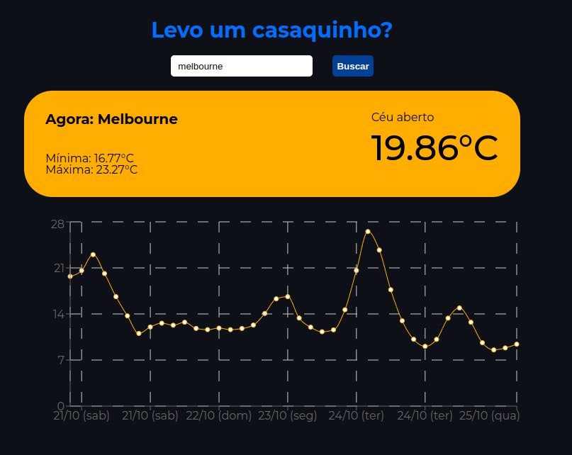

# Levo um casaquinho?

An easy-to-use weather application. Stay informed about the weather in any city around the world, receive a 5-day weather forecast, and plan your trips knowing the weather conditions.



Try it out now at <a href="https://do-i-take-a-little-jacket.vercel.app" rel="noopener noreferrer">https://do-i-take-a-little-jacket.vercel.app</a>

## About

This is a web application that allows users to check the weather in any city around the world. Here are the implemented features:

- Search and display the current weather for a specific location.
- Show a 5-day weather forecast.
- Visualize weather conditions, such as rain, snow, clear skies, and more.

With this app, users can plan their activities and trips while staying informed about the weather conditions in their desired locations.

## Technologies
The following tools and frameworks were used in the construction of the project:<br>
<p>
  
  
  
  
  
  
  
  
</p>

## How to run

1. Clone this repository
2. Install dependencies
```bash
npm i
```
3. Run the front-end with
```bash
npm run dev
```
4. You can optionally build the project running
```bash
npm run build
```
5. Finally access http://localhost:5173 on your favorite browser
